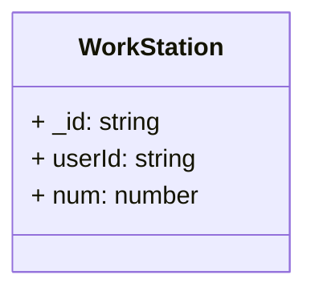

# Ejercicio Typescript + MongoDB

Para este ejercicio he creado un subdirectorio para la capa de servicio en la que contiene las operaciones CRUD `WorkStationManager.ts` y el modelo `WorkStation.ts`.

A parte de eso, para saber que lo he hecho bien he escrito la función `ServiceLayerTest()` en `mongoose.ts`.

## Test
1. Transpilalo a javascript:
`tsc`
2. Ejecuta con NodeJs:
`node dist/mongoose.js`