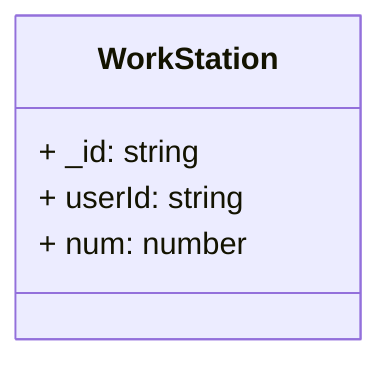

# Ejercicio Typescript + MongoDB

Para este ejercicio he creado un subdirectorio para la capa de servicio en la que contiene las operaciones CRUD `WorkStationManager.ts` y el modelo `WorkStation.ts`.

A parte de eso, para saber que lo he hecho bien he escrito la función `ServiceLayerTest()` en `mongoose.ts`.

## Test
1. Transpilalo a javascript:
`tsc`
2. Ejecuta con NodeJs:
`node dist/mongoose.js`

## Referencias usadas en este ejercicio
+ [*Zammetti, F. W. (2020). Modern full-stack development : using TypeScript, React, Node.js, Webpack, and Docker. Apress.*](https://doi.org/10.1007/978-1-4842-5738-8): Es una edición antigua y ni siquiera lo he acabado de leer.
+ [Curso MERN que habia seguido el verano pasado con un proyecto subido en un repositorio privado.](https://youtu.be/8s_ZbPkPkRk?si=OwoNDgn7tdzwiRm5)
+ [El video de typescript para refrescar memoria.](https://www.youtube.com/watch?embed=no&v=Xxqh0RoWxNc)
+ [El video para profundizarme en Mongoose.](https://www.youtube.com/watch?embed=no&v=gfP3aqV38q4)
+ [Y sobretodo la documentación oficial de Mongoose.](https://mongoosejs.com/docs/api/model.html)
